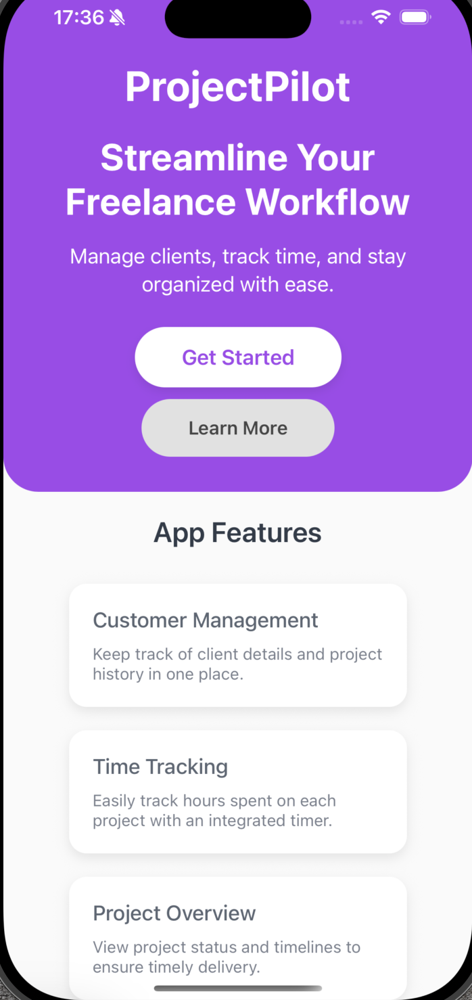
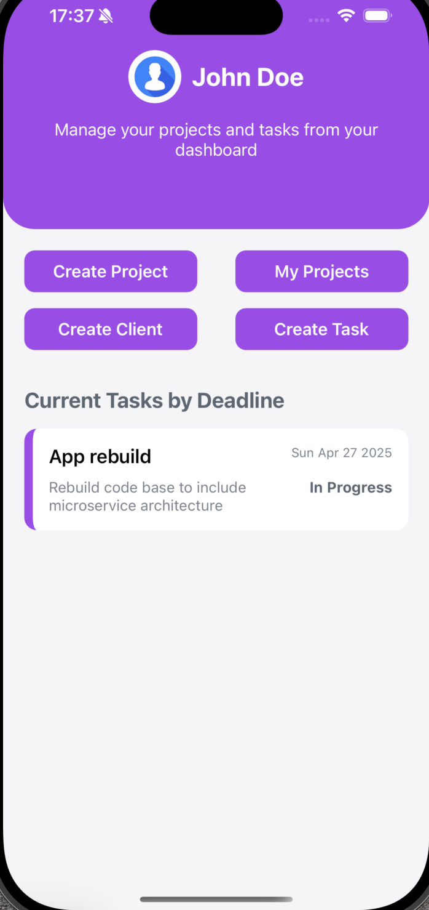
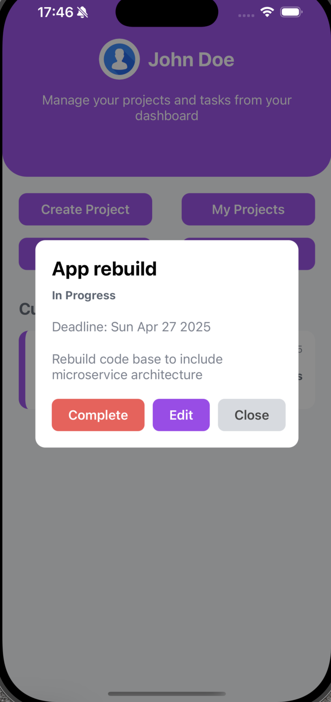
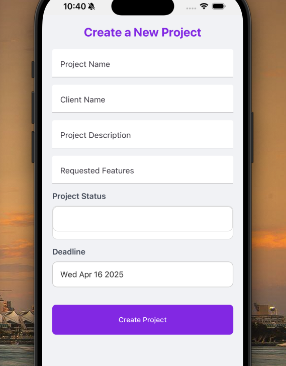

# ProjectPilot 📋💼

**ProjectPilot** is a productivity-focused mobile app built to help freelancers stay organized and efficient. Whether you're juggling multiple clients, managing complex projects, or breaking down your workflow into bite-sized tasks, this app keeps everything in one place.

---

## 🚀 Features

- **🗂 Project Management**
  - Create and manage projects with titles, features, and deadlines
  - Keep an overview of what needs to be done and when

- **✅ Task Tracking**
  - Break projects into small, actionable tasks
  - Edit tasks as your workflow evolves
  - Mark tasks as complete and stay focused

- **👥 Client Organizer**
  - Add and manage a list of your clients
  - View all projects and tasks associated with a specific client

- **📆 Deadlines & Reminders**
  - Set project and task deadlines to stay on track
  - Visual indicators of upcoming due dates

---

✨ Coming Soon

Notifications & reminders  
Analytics & productivity insights  
Export reports for clients  
Sync across devices

---

## 📱 Screenshots

---

## 🛠 Tech Stack

- **React Native** – Cross-platform mobile app development
- **Express.js** – Backend API for managing data
- **MongoDB & Mongoose** – Database & data modeling
- **Axios** – Network requests between client and server
- **React Native Paper** – UI components with a native feel
- **DateTimePicker** – User-friendly date input

---

